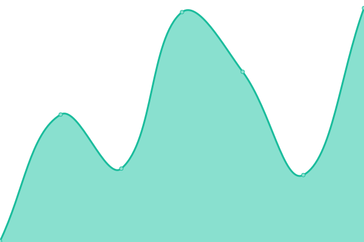
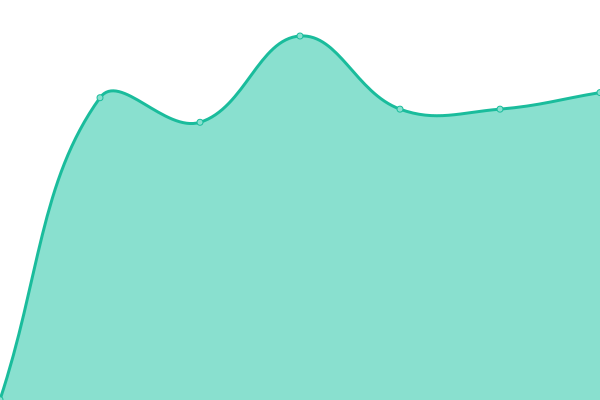
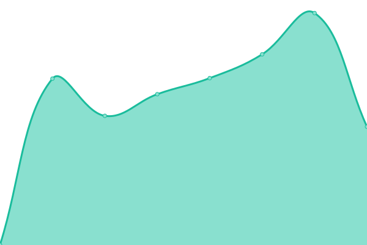
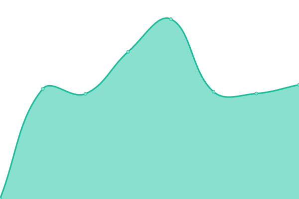
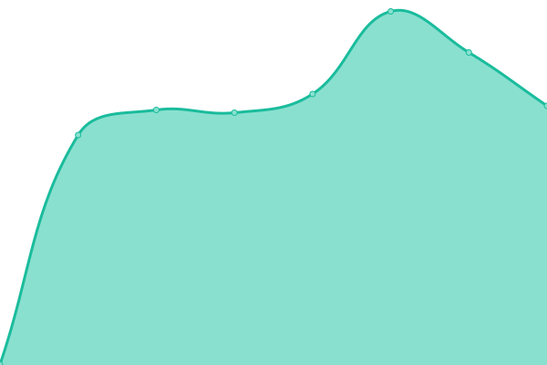
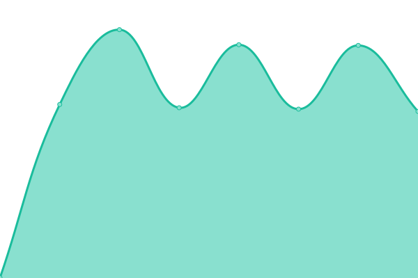
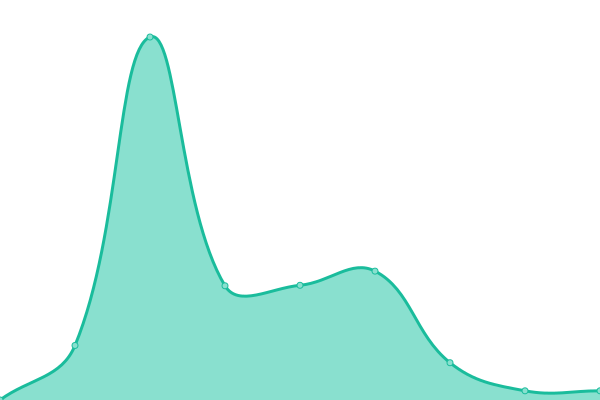
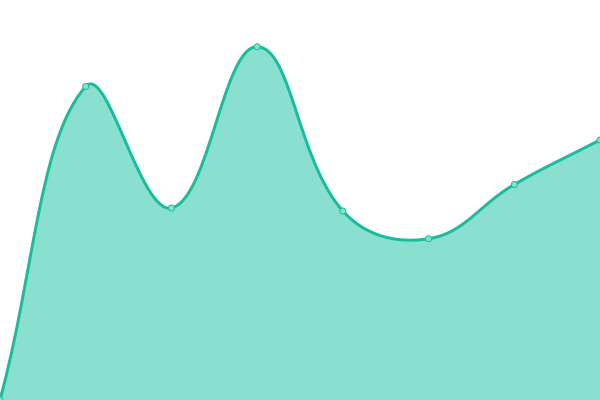

# [📈 Live Status](https://ecoweb-dot-host.github.io/upptime): <!--live status--> **🟩 All systems operational**

This repository contains the open-source uptime monitor and status page for [ecoweb-dot-host](https://ecoweb-dot-host.github.io/upptime), powered by [Upptime](https://github.com/upptime/upptime).

With [Upptime](https://upptime.js.org), you can get your own unlimited and free uptime monitor and status page, powered entirely by a GitHub repository. We use [Issues](https://github.com/ecoweb-dot-host/upptime/issues) as incident reports, [Actions](https://github.com/ecoweb-dot-host/upptime/actions) as uptime monitors, and [Pages](https://ecoweb-dot-host.github.io/upptime) for the status page.

<!--start: status pages-->
<!-- This summary is generated by Upptime (https://github.com/upptime/upptime) -->
<!-- Do not edit this manually, your changes will be overwritten -->
<!-- prettier-ignore -->
| URL | Status | History | Response Time | Uptime |
| --- | ------ | ------- | ------------- | ------ |
|  [AquaticTherapy.co.uk](https://aquatictherapy.co.uk/) | 🟩 Up | [aquatic-therapy-co-uk.yml](https://github.com/ecoweb-dot-host/upptime/commits/HEAD/history/aquatic-therapy-co-uk.yml) | 

 1588ms
     
 | 

<a href="https://ecoweb-dot-host.github.io/upptime/history/aquatic-therapy-co-uk">100.00%</a>
    

|  [Ecoweb.Host](https://ecoweb.host/) | 🟩 Up | [ecoweb-host.yml](https://github.com/ecoweb-dot-host/upptime/commits/HEAD/history/ecoweb-host.yml) | 

 696ms
     
 | 

<a href="https://ecoweb-dot-host.github.io/upptime/history/ecoweb-host">100.00%</a>
    

|  [LymphingAlong.com](https://lymphingalong.com/) | 🟩 Up | [lymphing-along-com.yml](https://github.com/ecoweb-dot-host/upptime/commits/HEAD/history/lymphing-along-com.yml) | 

 754ms
     
 | 

<a href="https://ecoweb-dot-host.github.io/upptime/history/lymphing-along-com">100.00%</a>
    

|  [NeilDonnelly.ie](https://neildonnelly.ie/) | 🟩 Up | [neil-donnelly-ie.yml](https://github.com/ecoweb-dot-host/upptime/commits/HEAD/history/neil-donnelly-ie.yml) | 

 1849ms
     
 | 

<a href="https://ecoweb-dot-host.github.io/upptime/history/neil-donnelly-ie">100.00%</a>
    

|  [Oisin.page](https://oisin.page) | 🟩 Up | [oisin-page.yml](https://github.com/ecoweb-dot-host/upptime/commits/HEAD/history/oisin-page.yml) | 

 1202ms
     
 | 

<a href="https://ecoweb-dot-host.github.io/upptime/history/oisin-page">100.00%</a>
    

|  [PaulColreavy.com](https://paulcolreavy.com/) | 🟩 Up | [paul-colreavy-com.yml](https://github.com/ecoweb-dot-host/upptime/commits/HEAD/history/paul-colreavy-com.yml) | 

 1335ms
     
 | 

<a href="https://ecoweb-dot-host.github.io/upptime/history/paul-colreavy-com">100.00%</a>
    

|  [QualitySeaVeg.ie](https://qualityseaveg.ie/) | 🟩 Up | [quality-sea-veg-ie.yml](https://github.com/ecoweb-dot-host/upptime/commits/HEAD/history/quality-sea-veg-ie.yml) | 

 549ms
     
 | 

<a href="https://ecoweb-dot-host.github.io/upptime/history/quality-sea-veg-ie">99.80%</a>
    

|  [RIPcounties.ie](https://ripcounties.ie/) | 🟩 Up | [ri-pcounties-ie.yml](https://github.com/ecoweb-dot-host/upptime/commits/HEAD/history/ri-pcounties-ie.yml) | 

 847ms
     
 | 

<a href="https://ecoweb-dot-host.github.io/upptime/history/ri-pcounties-ie">100.00%</a>
    

|  [SligoWellness.com](https://sligowellness.com/) | 🟩 Up | [sligo-wellness-com.yml](https://github.com/ecoweb-dot-host/upptime/commits/HEAD/history/sligo-wellness-com.yml) | 

 1502ms
     
 | 

<a href="https://ecoweb-dot-host.github.io/upptime/history/sligo-wellness-com">99.72%</a>
    

|  [The ArkCounselling.ie](https://thearkcounselling.ie/) | 🟩 Up | [the-ark-counselling-ie.yml](https://github.com/ecoweb-dot-host/upptime/commits/HEAD/history/the-ark-counselling-ie.yml) | 

 948ms
     
 | 

<a href="https://ecoweb-dot-host.github.io/upptime/history/the-ark-counselling-ie">100.00%</a>
    

|  [Turbike.org](https://turbike.org) | 🟩 Up | [turbike-org.yml](https://github.com/ecoweb-dot-host/upptime/commits/HEAD/history/turbike-org.yml) | 

 1373ms
     
 | 

<a href="https://ecoweb-dot-host.github.io/upptime/history/turbike-org">100.00%</a>
    

|  [WereYouInformed.com](https://wereyouinformed.com/) | 🟩 Up | [were-you-informed-com.yml](https://github.com/ecoweb-dot-host/upptime/commits/HEAD/history/were-you-informed-com.yml) | 

 2519ms
     
 | 

<a href="https://ecoweb-dot-host.github.io/upptime/history/were-you-informed-com">80.41%</a>
    

|  [YourVaacineSafety.ie](https://yourvaccinesafety.ie/) | 🟩 Up | [your-vaacine-safety-ie.yml](https://github.com/ecoweb-dot-host/upptime/commits/HEAD/history/your-vaacine-safety-ie.yml) | 

 851ms
     
 | 

<a href="https://ecoweb-dot-host.github.io/upptime/history/your-vaacine-safety-ie">100.00%</a>
    

<!--end: status pages-->

[**Visit our status website →**](https://ecoweb-dot-host.github.io/upptime)

## 📄 License

- Powered by: [Upptime](https://github.com/upptime/upptime)
- Code: [MIT](./LICENSE) © [Anand Chowdhary](https://anandchowdhary.com), supported by [Pabio](https://pabio.com)
- Data in the `./history` directory: [Open Database License](https://opendatacommons.org/licenses/odbl/1-0/)
